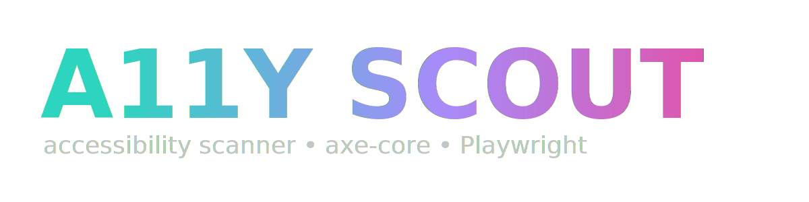

<div align="center">

# 🎯 A11Y Scout

### *The Ultimate Accessibility Scanner for Modern Web Development*

[](https://python.org)
[](https://playwright.dev)
[](https://github.com/dequelabs/axe-core)
[](LICENSE)



---

## 🌟 **Revolutionary Accessibility Testing Made Simple**

> **Transform your web development workflow with the most advanced, user-friendly accessibility scanner ever built.**

</div>

---

## 🚀 **What Makes A11Y Scout Special?**

<div align="center">

| 🎨 **Beautiful UI** | ⚡ **Lightning Fast** | 🔧 **Developer Friendly** | 📊 **Comprehensive Reports** |
|:---:|:---:|:---:|:---:|
| Stunning terminal animations<br/>Rich color schemes<br/>Dynamic banners | Powered by Playwright<br/>Headless browser automation<br/>Parallel processing | Simple CLI interface<br/>JSON output support<br/>CI/CD integration | WCAG 2.x compliance<br/>Detailed violation reports<br/>Actionable fix suggestions |

</div>

---

## 🎬 **Live Demo**

```bash
# Watch the magic happen! ✨
a11y-scout https://example.com
```

<div align="center">

### 🎭 **Terminal Animation Preview**

```
╔══════════════════════════════════════════════════════════════════════════════╗
║    _    ___  __   __   __   _____                 _                         ║
║   / \  / _ \ \ \ / /  / _| | ____|  ___   ___  __| | ___ ___                 ║
║  / _ \| | | | \ V /  | |_  |  _|   / _ \ / _ \/ _` |/ __/ _ \                ║
║ / ___ \ |_| |  | |   |  _| | |___ | (_) |  __/ (_| | (_|  __/                ║
║/_/   \_\___/   |_|   |_|   |_____| \___/ \___|\__,_|\___\___|                 ║
║                    A11Y SCOUT · accessibility scanner                        ║
║                                                                              ║
║              🌊🌀💫✨🌟💎🔥⚡💥 axe-core · Playwright · v0.1.0 ✨💎🌟💫🌀🌊              ║
╚══════════════════════════════════════════════════════════════════════════════╝
```

</div>

---

## 🛠️ **Installation & Setup**

### **Quick Start** 🚀

```bash
# Clone the repository
git clone https://github.com/yourusername/a11y-scout.git
cd a11y-scout

# Install dependencies
pip install -e .

# Optional: Install chafa for enhanced logo display
# macOS
brew install chafa

# Ubuntu/Debian
sudo apt-get install chafa
```

### **Advanced Installation** ⚙️

```bash
# Install with specific Playwright version
pip install "playwright>=1.45"

# Install browser dependencies
playwright install chromium

# Verify installation
a11y-scout --help
```

---

## 🎯 **Usage Examples**

### **Basic Usage** 🔍

```bash
# Run the tool - it will prompt for URL
a11y-scout

# The tool will ask for a website URL to scan
# Results will be displayed in the terminal
# Option to save results to JSON file
```

### **Save Results** 💾

```bash
# The tool will prompt you to save results after scanning
# Results are saved as JSON format
```

### **Environment Variables** ⚙️

```bash
# Disable banner for CI environments
A11Y_SCOUT_NO_BANNER=1 a11y-scout https://example.com
```

---

## 📊 **Sample Output**

<div align="center">

### 🎨 **Rich Terminal Output**

```
🔍 Scanning: https://example.com
ℹ️  Initializing accessibility scanner...

⚠️  Found 3 accessibility violations

📋 VIOLATIONS FOUND:
============================================================

🔴 1. color-contrast (serious impact)
   📝 Elements must have sufficient color contrast
   🔧 Ensures the contrast between foreground and background colors meets WCAG 2 AA contrast ratio thresholds
   🔗 https://dequeuniversity.com/rules/axe/4.7/color-contrast

🟡 2. image-alt (moderate impact)
   📝 Images must have alternate text
   🔧 Ensures  elements have alternate text or a role of none or presentation
   🔗 https://dequeuniversity.com/rules/axe/4.7/image-alt

🔵 3. link-name (minor impact)
   📝 Links must have discernible text
   🔧 Ensures every link element has a discernible, non-empty, non-redundant accessible name
   🔗 https://dequeuniversity.com/rules/axe/4.7/link-name

💾 Save results to file? (y/n): y
📁 Enter filename (default: violations.json): 
✅ Results saved to violations.json

🎉 Thank you for using A11Y-SCOUT! Keep building accessible web experiences!
```

</div>

---

## 🎨 **Features & Capabilities**

<div align="center">

### 🌈 **Visual Features**

| Feature | Description | Impact |
|---------|-------------|---------|
| 🎭 **Animated Banners** | Dynamic ASCII art with wave effects | Enhanced user experience |
| 🌈 **Rich Colors** | 256-color terminal support with gradients | Professional appearance |
| ⚡ **Live Spinners** | Real-time progress indicators | Clear feedback |
| 🎯 **Smart Icons** | Context-aware emoji and symbols | Intuitive navigation |

### 🔧 **Technical Features**

| Feature | Description | Benefit |
|---------|-------------|---------|
| 🚀 **Playwright Engine** | Modern browser automation | Reliable, fast scanning |
| 🎯 **axe-core Integration** | Industry-standard accessibility engine | Comprehensive coverage |
| 📊 **JSON Output** | Structured data export | Easy integration |
| 🔄 **CI/CD Ready** | Automated testing support | Continuous accessibility |

</div>

---

## 🎯 **Accessibility Standards**

<div align="center">

### 📋 **WCAG 2.x Compliance**

| Level | Description | Coverage |
|-------|-------------|----------|
| **A** | Basic accessibility requirements | ✅ Full support |
| **AA** | Enhanced accessibility standards | ✅ Full support |
| **AAA** | Advanced accessibility features | 🔄 Partial support |

### 🎨 **Supported Standards**

- **WCAG 2.1** - Web Content Accessibility Guidelines
- **Section 508** - US Federal accessibility requirements
- **EN 301 549** - European accessibility standard
- **ADA Compliance** - Americans with Disabilities Act

</div>

---

## 🛠️ **Development & Contributing**

### **Project Structure** 📁

```
a11y-scout/
├── 🎨 assets/                 # Visual assets and logos
├── 🧠 src/a11y_scout/         # Core application logic
│   ├── 🎯 core.py             # Main scanning engine
│   ├── 🖥️ cli.py              # Command-line interface
│   └── 🎨 ui/                  # User interface components
│       ├── 🌊 hero.py         # Animated banners
│       ├── 🎭 banner.py       # Logo display
│       └── 🎨 logo.py         # Logo rendering
├── 🧪 tests/                  # Test suite
├── 📦 pyproject.toml          # Project configuration
└── 📖 README.md               # This file
```

### **Contributing Guidelines** 🤝

```bash
# Fork the repository
git clone https://github.com/yourusername/a11y-scout.git

# Create feature branch
git checkout -b feature/amazing-feature

# Install development dependencies
pip install -e ".[dev]"

# Run tests
python -m pytest tests/

# Submit pull request
```

---

## 🎨 **Customization & Theming**

### **Environment Variables** 🌈

```bash
# Disable banner display
export A11Y_SCOUT_NO_BANNER=1
```

### **Output Format** 📊

```bash
# JSON output is the only supported format
# The tool saves violations as JSON when requested
```

---

## 🚀 **How It Works**

<div align="center">

### ⚡ **Technical Details**

| Component | Technology | Purpose |
|-----------|-------------|---------|
| **Browser Automation** | Playwright | Launches Chromium in headless mode |
| **Accessibility Engine** | axe-core 4.7.2 | Industry-standard accessibility testing |
| **Scanning Process** | JavaScript injection | Runs axe-core in page context |
| **Output Format** | JSON | Structured violation data |

### 🎯 **Scanning Process**

1. **Launch Browser** - Playwright starts Chromium
2. **Navigate to URL** - Load the target website
3. **Inject axe-core** - Add accessibility testing library
4. **Run Analysis** - Execute accessibility checks
5. **Extract Results** - Return violations and metadata

</div>

---

## 🎭 **Screenshots & Demos**

<div align="center">

### 🎨 **Terminal Interface**

```
┌─────────────────────────────────────────────────────────────────────────────┐
│ 🔍 CAPABILITIES                                                             │
│ What A11Y Scout Does                                                       │
│ • Scans websites for accessibility violations                              │
│ • Uses industry-standard axe-core engine                                   │
│ • Generates detailed JSON/CLI reports                                     │
│ • Targets WCAG 2.x A/AA compliance standards                              │
│ • Provides actionable fix suggestions                                      │
│                                                                             │
│ 🚀 USAGE                                                                    │
│ How to Use the Tool                                                         │
│ • a11y-scout <website-url>                                                 │
│ • --out report.json    Save results to file                                │
│ • --fail-on N          Fail CI if N+ violations found                     │
│ • --help               Show all available options                          │
│ • --verbose            Show detailed scan progress                         │
│                                                                             │
│ 💡 PURPOSE                                                                 │
│ Why We Built This                                                          │
│ • Make accessibility testing effortless                                    │
│ • Help teams build inclusive web experiences                              │
│ • Ensure compliance with accessibility standards                           │
│ • Integrate seamlessly into CI/CD pipelines                               │
│ • Provide clear, actionable improvement guidance                          │
└─────────────────────────────────────────────────────────────────────────────┘
✨ Built with Python • Playwright • axe-core ✨
```

</div>

---

## 🎯 **Use Cases**

### **Web Development** 👥

```bash
# Test your website for accessibility issues
a11y-scout
# Enter your website URL when prompted
# Review violations and fix them
```

### **Quality Assurance** 🧪

```bash
# Check accessibility before deployment
a11y-scout
# Save results to file for documentation
# Share findings with development team
```

---

## 🎨 **Features**

### **Rich Terminal Interface** ⚙️

- **Animated Banners** - Dynamic ASCII art with wave effects
- **Color-coded Results** - Different colors for violation severity
- **Interactive Prompts** - User-friendly input and save options
- **Progress Indicators** - Spinning animations during scanning

### **Accessibility Standards** 🔌

- **WCAG 2.x Compliance** - Tests against accessibility guidelines
- **axe-core Integration** - Industry-standard testing engine
- **Detailed Reports** - Comprehensive violation information
- **Fix Suggestions** - Actionable improvement guidance

---

## 🎯 **Troubleshooting**

### **Common Issues** 🔧

| Issue | Solution | Prevention |
|-------|----------|------------|
| **Browser not found** | `playwright install chromium` | Install Playwright browsers |
| **Logo not showing** | Install chafa | `brew install chafa` or `sudo apt-get install chafa` |
| **Network errors** | Check URL accessibility | Verify website is reachable |
| **Permission errors** | Check file permissions | Ensure write access for JSON output |

### **Common Solutions** 🐛

```bash
# Install Playwright browsers if missing
playwright install chromium

# Check if chafa is installed for logo display
brew install chafa  # macOS
sudo apt-get install chafa  # Ubuntu/Debian

# Disable banner if having display issues
A11Y_SCOUT_NO_BANNER=1 a11y-scout
```

---


## 🎯 **License & Legal**

<div align="center">

### 📄 **License**

This project is licensed under the **MIT License** - see the [LICENSE](LICENSE) file for details.

### 🛡️ **Privacy & Security**

- **No Data Collection** - We don't store your scan results
- **Local Processing** - All scanning happens on your machine
- **Open Source** - Full transparency in our codebase
- **Security First** - Regular security audits and updates

</div>

---

<div align="center">

## 🎉 **Ready to Transform Your Accessibility Workflow?**

### **Get Started Today!** 🚀

```bash
# Install the tool
pip install -e .

# Start scanning
a11y-scout
```

---

### 🌟 **Made with ❤️ for the Accessibility Community**

**A11Y Scout** - *Making the web accessible, one scan at a time* ✨

[](https://github.com/yourusername/a11y-scout)
[](https://python.org)
[](https://playwright.dev)

</div>
